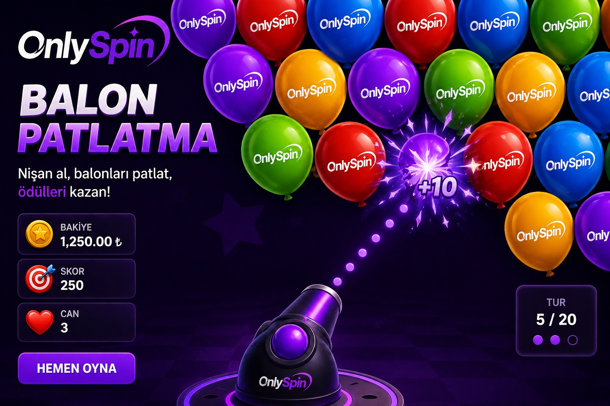

# 🎈 OnlySpin Balon Patlat Oyunu

> **OnlySpin Türkiye** resmi giriş adresi: [onlyspin.com.tr](https://onlyspin.com.tr)

---

## 🎰 OnlySpin Nedir?

**OnlySpin**, 2026 yılında Türkiye pazarına giriş yapan, yerli çıkışlı bir oyun platformu ve markasıdır. Son dönemde özellikle sosyal medyada adını sıkça duyduğumuz yerli girişimlerden biri olan OnlySpin, klasik oyun platformlarının "teknik" ve "hardcore" görünümünün aksine; akılda kalıcı, popüler kültüre göz kırpan bir isim ve tasarım diliyle dikkat çekmektedir.

**OnlySpin Türkiye**, büyük global oyun servislerine yerli bir alternatif olma hedefiyle yola çıkmış; kullanıcı deneyimi ve erişilebilirlik konusunda sade bir yapı sunmayı amaçlamaktadır. Özellikle yerel pazarda "güvenli ve tercih edilebilir" bir platform imajı oluşturma çabası dikkat çeken OnlySpin, kullanıcı yorumlarında bu algının karşılık bulduğu bir marka olarak öne çıkmaktadır.

---

## 🌐 OnlySpin Giriş — Resmi Adres

**OnlySpin Türkiye** için resmi giriş adresi:

🔗 **[onlyspin.com.tr](https://onlyspin.com.tr)**

> OnlySpin'e erişmek için yukarıdaki resmi bağlantıyı kullanmanızı öneririz.  
> Alternatif veya üçüncü taraf bağlantılara dikkat edin; **OnlySpin giriş** için her zaman resmi adresi tercih edin.

---

## 🕹️ Bu Proje Hakkında

Bu repo, **OnlySpin** temalı eğlenceli bir **Balon Patlat HTML5 oyunu** içermektedir. Saf HTML, CSS ve JavaScript ile yazılmış olup herhangi bir framework veya kurulum gerektirmez.

### Özellikler

- ⏱️ **30 saniyelik** heyecanlı oyun modu
- 🎈 Farklı boyut ve hızlarda yükselen balonlar
- 💡 Küçük balonlar = daha yüksek puan (beceri gerektiren strateji)
- ✨ Tıklandığında patlama animasyonu ve anlık puan gösterimi
- 🏆 Oturum bazlı en yüksek skor takibi
- 📱 Masaüstü ve mobil uyumlu tasarım
- 🎨 **OnlySpin** marka renkleriyle özel mor/pembe tema

### Dosya Yapısı

```
balloon-game/
├── index.html   # Ana sayfa
├── style.css    # Tasarım ve animasyonlar
└── game.js      # Oyun mantığı
```

---

## 🚀 Nasıl Oynanır?

1. `index.html` dosyasını herhangi bir tarayıcıda açın
2. **BAŞLA** butonuna tıklayın
3. Ekrana yükselen balonlara tıklayarak puan toplayın
4. 30 saniye içinde mümkün olduğunca yüksek skor yapmaya çalışın!

---

## 🛠️ Kurulum

```bash
# Repoyu klonlayın
git clone https://github.com/kullanici-adi/onlyspin-balon-oyunu.git

# Klasöre girin
cd onlyspin-balon-oyunu/balloon-game

# index.html dosyasını tarayıcıda açın (sunucu gerekmez)
```

---

## 📌 OnlySpin Türkiye Hakkında Sık Sorulan Sorular

**OnlySpin güvenilir mi?**  
OnlySpin, yerel pazarda güvenilir bir platform imajı oluşturma çabası içinde olan, Türkiye'ye özel yerli bir oyun markasıdır.

**OnlySpin'e nasıl giriş yapılır?**  
[onlyspin.com.tr](https://onlyspin.com.tr) adresinden platforma kolayca erişebilirsiniz.

**OnlySpin Türkiye ne zaman kuruldu?**  
OnlySpin, 2026 yılında Türkiye pazarına giriş yapmıştır.

**OnlySpin'in uygulaması var mı?**  
Bu repodaki HTML5 uygulaması, OnlySpin temalı tarayıcı tabanlı bir eğlence deneyimi sunmaktadır.

---

## 🏷️ Etiketler

`onlyspin` `onlyspin türkiye` `onlyspin giriş` `onlyspin.com.tr` `onlyspin oyun` `balon patlat` `html5 oyun` `türk oyun platformu` `onlyspin 2026`

---

## 📄 Lisans

MIT License — Özgürce kullanabilirsiniz.

---

*Bu proje **OnlySpin Türkiye** temalı açık kaynaklı bir eğlence uygulamasıdır.*  
*Resmi platform: [onlyspin.com.tr](http://onlyspin.com.tr)*
